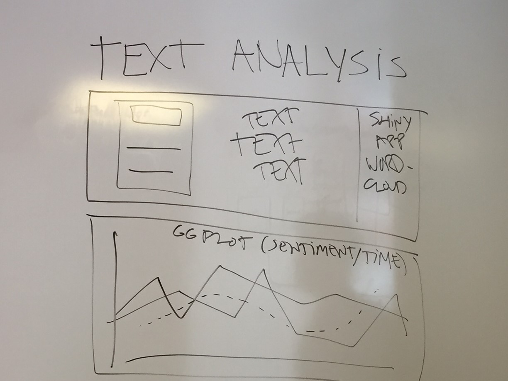

Process Book
================
Mallory Evans, Hana Konradova, and Tomas Nazal Paredes
April 30, 2017

NYPD Stop and Frisk Data
========================

Using data from 2010 to 2015, we wanted to examine general trends in the NYPD Stop and Frisk Program, provide informative plots and maps about who was stopped and where, try to come to some conclusion about the effectiveness or impact of the program, and investigate public opinion about it through a text analysis.

Data Wrangling and Plots
------------------------

The data for examining trends for 2010-2016 were acquired using the R script in the Data\_setup.R file that downloads the Stop and Frisk database right from the NYPD's website. Specifications of all the variables contained in the database are available in the Data folder. The data on crime levels were acquire from the <ahref="">http://www.nyc.gov/html/nypd/html/analysis\_and\_planning/historical\_nyc\_crime\_data.shtml</a> website. To compare general level of crime with stops, we used overall statistics for the years of 2010-2015. As for the general level of felony crimes, we summed up statistics for the seven major felony offenses and other felony offenses to provide a more straightforwad picture about an overall development of crime occurance in New York City.

We had to deal with one issue regarding the age variable since, in the original dataset, its values range from 0 to 999, suggesting that the number doesn't directly correspond to the suspects' age. Also, when comparing the age with DOB of the suspects, we noticed quite a lot of discrepancies between the two variables, supporting our suspicion that these variables haven't been recorded properly. The file with variables specification doesn't provide any information on that and even searching for explanation on the web didn't bring any clarification. Examining the values and existing analyses of the dataset lead us to a solution of dividing the variable by ten, supposing the age variable refers to the age of the suspects in decimals. For the rest of the trends depiction, we opted for using percentages of stops with the respective characteristics instead of absolute counts since they offer more direct and comparable information. For better clarity, we merged the race categories into four main groups: Black, White, Hispanic (including both black and white Hispanics), and Other (including Asian/Pacific Islander, Am. Indian/Native, and other suspects). Most of the data wraingling was done using the `dplyr` package with the following code.

``` r
### get the data created by Data_setup.R
subset_data <- read.csv("subset_data.csv")

### get & set up the data on crime levels
felony_m <- read.xlsx("seven-major-felony-offenses-2000-2016.xls",
                      sheetIndex = 1, startRow = 5)
felony_m <- felony_m[grep("TOTAL", felony_m$OFFENSE), ]
felony_m <- t(felony_m[ ,c(12:17)])
colnames(felony_m) <- c("felony_m")
felony_nm <- read.xlsx("non-seven-major-felony-offenses-2000-2016.xls",
                       sheetIndex = 1, startRow = 5)
felony_nm <- felony_nm[grep("TOTAL", felony_nm$OFFENSE), ]
felony_nm <- t(felony_nm[ ,c(12:17)])
colnames(felony_nm) <- c("felony_nm")
misdemeanor <- read.xlsx("misdemeanor-offenses-2000-2016.xls",
                         sheetIndex = 1, startRow = 4)
misdemeanor <- misdemeanor[grep("TOTAL", misdemeanor$OFFENSE), ]
misdemeanor <- t(misdemeanor[ ,c(12:17)])
colnames(misdemeanor) <- c("misdemeanor")

### prepare data on race using dplyr
overall_race <- subset_data %>% 
    dplyr::group_by(year, race) %>% 
    summarise(freq = n())

### create race categories and count frequencies
stat_black <- overall_race[overall_race$race == "B", -2] %>% 
    rename(freq_black = freq)
stat_white <- overall_race[overall_race$race == "W", -2] %>% 
    rename(freq_white = freq)
stat_hisp <- overall_race[overall_race$race == "P" | overall_race$race == "Q", -2] %>% 
    group_by(year) %>% 
    summarize(freq_hisp = sum(freq))
stat_other <- overall_race[overall_race$race == "A" | overall_race$race == "I" |
                           overall_race$race == "X" | overall_race$race == "Z", -2] %>% 
    group_by(year) %>% 
    summarize(freq_other = sum(freq))
stat_all <- overall_race %>% group_by(year) %>% 
    summarize(freq_all = sum(freq))

### count frequencies for gender categories
stat_gender <- subset_data %>% 
    group_by(year, sex) %>% 
    summarise(freq_gender = n())
stat_men <- stat_gender[stat_gender$sex == "M", ] %>% 
    rename(freq_men = freq_gender)
stat_women <- stat_gender[stat_gender$sex == "F", ] %>% 
    rename(freq_women = freq_gender)
stat_unknown <- stat_gender[stat_gender$sex == "Z", ] %>% 
    rename(freq_unknown = freq_gender)

### count frequencies for stops where arrest was made, force was used or contraband/weapon was ### found
stat_arrest <- subset_data %>% 
    group_by(year, arstmade) %>% 
    summarise(freq_arst = n()) %>% 
    filter(arstmade == "Y")
stat_contrabn <- subset_data %>% 
    group_by(year, contrabn) %>% 
    summarise(freq_contrabn = n()) %>% 
    filter(contrabn == "Y")
stat_pistol <- subset_data %>% 
    group_by(year, pistol) %>% 
    summarise(freq_pistol = n()) %>% 
    filter(pistol == "Y" | pistol == "1") %>% 
    group_by(year) %>% 
    summarise(freq_pistol = sum(freq_pistol))
stat_riflshot <- subset_data %>% 
    group_by(year, riflshot) %>% 
    summarise(freq_riflshot = n()) %>% 
    filter(riflshot == "Y" | riflshot == "1") %>% 
    group_by(year) %>% 
    summarise(freq_riflshot = sum(freq_riflshot))
stat_asltweap <- subset_data %>% 
    group_by(year, asltweap) %>% 
    summarise(freq_asltweap = n()) %>% 
    filter(asltweap == "Y" | asltweap == "1") %>% 
    group_by(year) %>% 
    summarise(freq_asltweap = sum(freq_asltweap))
stat_knifcuti <- subset_data %>% 
    group_by(year, knifcuti) %>% 
    summarise(freq_knifcuti = n()) %>% 
    filter(knifcuti == "Y" | knifcuti == "1") %>% 
    group_by(year) %>% 
    summarise(freq_knifcuti = sum(freq_knifcuti))
stat_machgun <- subset_data %>% 
    group_by(year, machgun) %>% 
    summarise(freq_machgun = n()) %>% 
    filter(machgun == "Y") 
stat_machgun[5:6, 1] <- c(2014, 2015)
stat_machgun[5:6, 3] <- c(0, 0)
stat_othrweap <- subset_data %>% 
    group_by(year, othrweap) %>% 
    summarise(freq_othrweap = n()) %>% 
    filter(othrweap == "Y" | othrweap == "1") %>% 
    group_by(year) %>% 
    summarise(freq_othrweap = sum(freq_othrweap))
stat_hands <- subset_data %>% 
    group_by(year, pf_hands) %>% 
    summarise(freq_hands = n()) %>% 
    filter(pf_hands == "Y" | pf_hands == "1") %>% 
    group_by(year) %>% 
    summarise(freq_hands = sum(freq_hands))
stat_wall <- subset_data %>% 
    group_by(year, pf_wall) %>% 
    summarise(freq_wall = n()) %>% 
    filter(pf_wall == "Y" | pf_wall == "1") %>% 
    group_by(year) %>% 
    summarise(freq_wall = sum(freq_wall))
stat_grnd <- subset_data %>% 
    group_by(year, pf_grnd) %>% 
    summarise(freq_grnd = n()) %>% 
    filter(pf_grnd == "Y" | pf_grnd == "1") %>% 
    group_by(year) %>% 
    summarise(freq_grnd = sum(freq_grnd))
stat_drwep <- subset_data %>% 
    group_by(year, pf_drwep) %>% 
    summarise(freq_drwep = n()) %>% 
    filter(pf_drwep == "Y" | pf_drwep == "1") %>% 
    group_by(year) %>% 
    summarise(freq_drwep = sum(freq_drwep))
stat_ptwep <- subset_data %>% 
    group_by(year, pf_ptwep) %>% 
    summarise(freq_ptwep = n()) %>% 
    filter(pf_ptwep == "Y" | pf_ptwep == "1") %>% 
    group_by(year) %>% 
    summarise(freq_ptwep = sum(freq_ptwep))
stat_baton <- subset_data %>% 
    group_by(year, pf_baton) %>% 
    summarise(freq_baton = n()) %>% 
    filter(pf_baton == "Y" | pf_baton == "1") %>% 
    group_by(year) %>% 
    summarise(freq_baton = sum(freq_baton))
stat_hcuff <- subset_data %>% 
    group_by(year, pf_hcuff) %>% 
    summarise(freq_hcuff = n()) %>% 
    filter(pf_hcuff == "Y" | pf_hcuff == "1") %>% 
    group_by(year) %>% 
    summarise(freq_hcuff = sum(freq_hcuff))
stat_pepsp <- subset_data %>% 
    group_by(year, pf_pepsp) %>% 
    summarise(freq_pepsp = n()) %>% 
    filter(pf_pepsp == "Y" | pf_pepsp == "1") %>% 
    group_by(year) %>% 
    summarise(freq_pepsp = sum(freq_pepsp))
stat_pfother <- subset_data %>% 
    group_by(year, pf_other) %>% 
    summarise(freq_pfother = n()) %>% 
    filter(pf_other == "Y" | pf_other == "1") %>% 
    group_by(year) %>% 
    summarise(freq_pfother = sum(freq_pfother))
subset_data$force <- ifelse(subset_data$pf_hands == "Y" | subset_data$pf_hands == "1" |
                                subset_data$pf_wall == "Y" | subset_data$pf_wall == "1" |
                                subset_data$pf_grnd == "Y" | subset_data$pf_grnd == "1" |
                                subset_data$pf_drwep == "Y" | subset_data$pf_drwep == "1" |
                                subset_data$pf_ptwep == "Y" | subset_data$pf_ptwep == "1" | 
                                subset_data$pf_baton == "Y" | subset_data$pf_baton == "1" |
                                subset_data$pf_hcuff == "Y" | subset_data$pf_hcuff == "1" |
                                subset_data$pf_pepsp == "Y" | subset_data$pf_pepsp == "1" |
                                subset_data$pf_other == "Y" | subset_data$pf_other == "1",
                            1, 0)
stat_force <- subset_data %>% 
    group_by(year, force) %>% 
    summarise(freq_force = n()) %>% 
    filter(force == 1)

### bind all the data to be used in the graphs and count percentages
overall_stats <- cbind.data.frame(stat_black, stat_white, stat_hisp, stat_other, stat_all, 
                                  felony_m, felony_nm, misdemeanor, stat_men, stat_women, 
                                  stat_unknown, stat_arrest, stat_contrabn, stat_pistol, 
                                  stat_riflshot, stat_asltweap, stat_knifcuti, stat_machgun,
                                  stat_othrweap, stat_hands, stat_wall, stat_grnd, stat_drwep,
                                  stat_ptwep, stat_baton, stat_hcuff, stat_pepsp, stat_pfother,
                                  stat_force)
overall_stats <- overall_stats[ , -c(3, 5, 7, 9, 14, 17)]
overall_stats <- overall_stats %>% 
    mutate(felony_total = felony_m + felony_nm) %>% 
    mutate(pct_black = round((freq_black / freq_all) * 100, 2)) %>% 
    mutate(pct_white = round((freq_white / freq_all) * 100, 2)) %>% 
    mutate(pct_hisp = round((freq_hisp / freq_all) * 100, 2)) %>% 
    mutate(pct_other = round((freq_other / freq_all) * 100, 2)) %>% 
    mutate(pct_men = round((freq_men / freq_all) * 100, 2)) %>% 
    mutate(pct_women = round((freq_women / freq_all) * 100, 2)) %>% 
    mutate(pct_unknown = round((freq_unknown / freq_all) * 100, 2)) %>% 
    mutate(pct_arrest = round((freq_arst / freq_all) * 100, 2)) %>% 
    mutate(pct_contrabn = round((freq_contrabn / freq_all) * 100, 2)) %>% 
    mutate(pct_wpn = round(((freq_pistol + freq_riflshot + freq_asltweap
                             + freq_knifcuti + freq_machgun + freq_othrweap) 
                            / freq_all) * 100, 2)) %>% 
    mutate(pct_hands = round((freq_hands / freq_all) * 100, 2)) %>% 
    mutate(pct_wall = round((freq_wall / freq_all) * 100, 2)) %>% 
    mutate(pct_grnd = round((freq_grnd / freq_all) * 100, 2)) %>% 
    mutate(pct_drwep = round((freq_drwep / freq_all) * 100, 2)) %>% 
    mutate(pct_ptwep = round((freq_ptwep / freq_all) * 100, 2)) %>%
    mutate(pct_baton = round((freq_baton / freq_all) * 100, 2)) %>% 
    mutate(pct_hcuff = round((freq_hcuff / freq_all) * 100, 2)) %>% 
    mutate(pct_pepsp = round((freq_pepsp / freq_all) * 100, 2)) %>% 
    mutate(pct_pfother = round((freq_pfother / freq_all) * 100, 2)) %>% 
    mutate(pct_force = round((freq_force / freq_all) * 100, 2))
```

All graphs for the temporal trends were created using the `plot_ly()` function from the `plotly` package to allow for interactivity and exploration of all the trends in isolation as well as in the context of other related variables. An example of such graph describing the development of overall frequency of stops together with race distribution over time is as follows. (This graph wasn't used in the final version of our application just because proportions are better described using bar charts that also allow for better comparison over time.)

``` r
plot_ly(overall_stats, x = ~year, y = ~freq_all, name = "All", 
        type = "scatter", mode = "lines+markers", fill = "tozeroy") %>% 
    add_trace(y = ~freq_black, name = "Black", type = "scatter", 
              mode = "lines+markers", fill = "tozeroy") %>% 
    add_trace(y = ~freq_hisp, name = "Hispanic", type = "scatter", 
              mode = "lines+markers", fill = "tozeroy") %>% 
    add_trace(y = ~freq_white, name = "White", type = "scatter", 
              mode = "lines+markers", fill = "tozeroy") %>% 
    add_trace(y = ~freq_other, name = "Other", type = "scatter", 
              mode = "lines+markers", fill = "tozeroy") %>% 
    layout(title = "Number of Stops by Race",
         xaxis = list(title = "Year", range = c(2009.7, 2015.3)),
         yaxis = list (title = "Count"))
```


Maps
----

We wanted to explore maps from the beginning and end of the period of data we looked at to see any major changes that happened, and because showing every year would be overwhelming. The NYPD Stop and Frisk data contained x and y coordinates, but they were projected in NAD83, so they needed to be converted to WGS84 for latitude and longitude. Race variables were recoded to reflect the 3 majority races - white, black, and Hispanic - with an "other" category encompassing the rest. Other variables were recoded for easy display, and subsets were created for different variables for exploratory maps. The below code was replicated for the 2010 data, but is not shown here.

``` r
sqf15 <- read.csv("2015_sqf_csv.csv", stringsAsFactors = FALSE)

sqf15 <- sqf15[!is.na(sqf15$xcoord), ]
sqf15_xy <- sqf15[, c(108, 109)]
sqf15_spdf <- SpatialPointsDataFrame(coords = sqf15_xy, data = sqf15, 
                                   proj4string = CRS("+proj=lcc +lat_1=41.03333333333333 
                                                     +lat_2=40.66666666666666 +lat_0=40.16666666666666 
                                                     +lon_0=-74 +x_0=300000.0000000001 +y_0=0 +ellps=GRS80 
                                                     +datum=NAD83 +to_meter=0.3048006096012192 +no_defs"))

#conver to correct projection of lat/long
sqf15_spdf_wgs84 <- spTransform(sqf15_spdf, CRS("+proj=longlat +ellps=WGS84 +datum=WGS84 +no_defs"))
sqf15_wgs84 <- as.data.frame(sqf15_spdf_wgs84)
sqf15_wgs84 <- sqf15_wgs84[, -c(108,109)]
sqf15_wgs84 <- rename(sqf15_wgs84, long = xcoord.1)
sqf15_wgs84 <- rename(sqf15_wgs84, lat = ycoord.1)

#recoding race variables
sqf15_wgs84$race[sqf15_wgs84$race == "B"] <- "Black"
sqf15_wgs84$race[sqf15_wgs84$race == "W"] <- "White"
sqf15_wgs84$race[sqf15_wgs84$race == "P" | 
                   sqf15_wgs84$race == "Q"] <- "Hispanic"
sqf15_wgs84$race[sqf15_wgs84$race == "A" | 
                   sqf15_wgs84$race == "I" |
                   sqf15_wgs84$race == "X" | 
                   sqf15_wgs84$race == "Z" | 
                   sqf15_wgs84$race == "U"] <- "Other"

#recoding sex variables
sqf15_wgs84$sex[sqf15_wgs84$sex == "M"] <- "Male"
sqf15_wgs84$sex[sqf15_wgs84$sex == "F"] <- "Female"
sqf15_wgs84$sex[sqf15_wgs84$sex == "Z"] <- "Unknown"

#Create variable to show if force was used at all
sqf15_wgs84$Force <- ifelse(sqf15_wgs84$pf_baton == "Y" | 
                              sqf15_wgs84$pf_hands == "Y" |
                              sqf15_wgs84$pf_wall == "Y" | 
                              sqf15_wgs84$pf_grnd == "Y" |
                              sqf15_wgs84$pf_drwep == "Y" |
                              sqf15_wgs84$pf_ptwep == "Y" |
                              sqf15_wgs84$pf_hcuff == "Y" |
                              sqf15_wgs84$pf_pepsp == "Y" |
                              sqf15_wgs84$pf_other == "Y", 1, 0)

sqf15_wgs84$Force[sqf15_wgs84$Force == 1] <- "Force Used"
sqf15_wgs84$Force[sqf15_wgs84$Force == 0] <- "No Force Used"

sqf15_wgs84$arstmade[sqf15_wgs84$arstmade == "Y"] <- "Arrest Made"
sqf15_wgs84$arstmade[sqf15_wgs84$arstmade == "N"] <- "No Arrest Made"

sqf15_wgs84$contrabn[sqf15_wgs84$contrabn == "Y"] <- "Contraband Found"
sqf15_wgs84$contrabn[sqf15_wgs84$contrabn == "N"] <- "No Contraband Found"

sqf15_wgs84$weapon <- ifelse(sqf15_wgs84$pistol == "Y" | 
                              sqf15_wgs84$riflshot == "Y" |
                              sqf15_wgs84$asltweap == "Y" | 
                              sqf15_wgs84$knifcuti == "Y" |
                              sqf15_wgs84$machgun == "Y" |
                              sqf15_wgs84$othrweap == "Y", 1, 0)

sqf15_wgs84$weapon[sqf15_wgs84$weapon == 1] <- "Weapon Found"
sqf15_wgs84$weapon[sqf15_wgs84$weapon == 0] <- "No Weapon Found"

#subset of stops using force only
force15 <- sqf15_wgs84[sqf15_wgs84$Force == "Force Used", ]

#subset of no force
noforce15 <- sqf15_wgs84[sqf15_wgs84$Force == "No Force Used", ]

#subset of arrests and contraband
arrests15 <- sqf15_wgs84[sqf15_wgs84$arstmade == "Arrest Made", ]
contraband15 <- sqf15_wgs84[sqf15_wgs84$contrabn == "Contraband Found", ]

#subset of weapons
weapon15 <- sqf15_wgs84[sqf15_wgs84$weapon == "Weapon Found", ]
```

#### Heat Maps

First we wanted to show all stops, but due to the overwhelming number of stops, the points completely covered the map. We chose to look at density to see where in the city the most stops occurred. After getting base stamen maps, we plotted many different heat maps to see what variables were interesting and informative. We definitely wanted to include a map for each year for the overall city, and one for each year zoomed in to the densest spot, which turned out to be Harlem. We tried several maps stratifying by race, force, and types of stop (like arrests and contraband), but decided that these were not so informative in addition to the other plots, and we didn't want to include so many heat maps because there were interactive plots we wanted instead.

``` r
theme_set(theme_minimal())
theme_map <- function(base_size=9, base_family="") {
    require(grid)
    theme_bw(base_size=base_size, base_family=base_family) %+replace%
    theme(axis.line=element_blank(),
          axis.text=element_blank(),
          axis.ticks=element_blank(),
          axis.title=element_blank(),
          panel.background=element_blank(),
          panel.border=element_blank(),
          panel.grid=element_blank(),
          panel.margin=unit(0, "lines"),
          plot.background=element_blank(),
          legend.justification = c(0,0),
          legend.position = c(0,0)
          )
}
```

``` r
map_NYC_st <- get_map("New York City", zoom = 11, source = "stamen", maptype = "toner-lite")
map_bk_st <- get_map("Brooklyn", zoom = 13, source = "stamen", maptype = "toner-lite")
map_harlem_st <- get_map("Harlem", zoom = 13, source = "stamen", maptype = "toner-lite")
map_qn_st <- get_map("Queens", zoom = 13, source = "stamen", maptype = "toner-lite")
```

``` r
ggmap(map_NYC_st) + 
  stat_density2d(aes(x = long, y = lat, fill=..level.., alpha=..level.., group = race), 
                                data = sqf10_wgs84, geom = "polygon") + 
  scale_alpha(range = c(0.00, 0.5), guide = FALSE) + 
  scale_fill_gradient(low = "yellow", high = "red") + 
  theme(legend.position = "left") + theme_map() + 
  theme(strip.text.x = element_text(size = 14, face = 2)) + 
  ggtitle("Density of Stops in New York City by Race - 2010") + facet_wrap(~race)
```


``` r
ggmap(map_NYC_st) + 
  stat_density2d(aes(x = long, y = lat, fill=..level.., alpha=..level.., group = race), 
                                data = sqf15_wgs84, geom = "polygon") + 
  scale_alpha(range = c(0.00, 0.5), guide = FALSE) + 
  scale_fill_gradient(low = "yellow", high = "red") + 
  theme(legend.position = "left") + theme_map() + 
  theme(strip.text.x = element_text(size = 14, face = 2)) + 
  ggtitle("Density of Stops in New York City by Race - 2015") + facet_wrap(~race)
```


``` r
ggmap(map_NYC_st) + 
  stat_density2d(aes(x = long, y = lat, fill=..level.., alpha=..level.., group = Force), 
                                data = sqf15_wgs84, geom = "polygon") + 
  scale_alpha(range = c(0.00, 0.5), guide = FALSE) + 
  scale_fill_gradient(low = "yellow", high = "red") + 
  theme(legend.position = "left") + theme_map() + 
  theme(strip.text.x = element_text(size = 14, face = 2)) + 
  ggtitle("Density of Stops by Use of Force - 2015") + facet_wrap(~Force)
```


``` r
ggmap(map_NYC_st) + 
  stat_density2d(aes(x = long, y = lat, fill=..level.., alpha=..level.., group = arstmade), 
                                data = sqf15_wgs84, geom = "polygon") + 
  scale_alpha(range = c(0.00, 0.5), guide = FALSE) + 
  scale_fill_gradient(low = "yellow", high = "red") + 
  theme(legend.position = "left") + theme_map() + 
  theme(strip.text.x = element_text(size = 14, face = 2)) + 
  ggtitle("Density of Stops by Arrests - 2015") + facet_wrap(~arstmade)
```


``` r
ggmap(map_NYC_st) + 
  stat_density2d(aes(x = long, y = lat, fill=..level.., alpha=..level.., group = contrabn), 
                                data = sqf15_wgs84, geom = "polygon") + 
  scale_alpha(range = c(0.00, 0.5), guide = FALSE) + 
  scale_fill_gradient(low = "yellow", high = "red") + 
  theme(legend.position = "left") + theme_map() + 
  theme(strip.text.x = element_text(size = 14, face = 2)) + 
  ggtitle("Density of Stops by Contraband Recovered - 2015") + facet_wrap(~contrabn) 
```


``` r
ggmap(map_harlem_st) + 
  stat_density2d(aes(x = long, y = lat, fill=..level.., alpha=..level..), 
                                data = sqf15_wgs84, geom = "polygon") + 
  scale_alpha(range = c(0.00, 0.5), guide = FALSE) + 
  scale_fill_gradient(low = "yellow", high = "red") + 
  theme(legend.position = "left") + theme_map() + 
  theme(strip.text.x = element_text(size = 14, face = 2)) + 
  ggtitle("Density of Stops in Harlem and Bronx - 2015") 
```


``` r
ggmap(map_bk_st) + 
  stat_density2d(aes(x = long, y = lat, fill=..level.., alpha=..level..), 
                                data = sqf15_wgs84, geom = "polygon") + 
  scale_alpha(range = c(0.00, 0.5), guide = FALSE) + 
  scale_fill_gradient(low = "yellow", high = "red") + 
  theme(legend.position = "left") + theme_map() + 
  theme(strip.text.x = element_text(size = 14, face = 2)) + 
  ggtitle("Density of Stops in Brooklyn - 2015")
```


``` r
ggmap(map_qn_st) + 
  stat_density2d(aes(x = long, y = lat, fill=..level.., alpha=..level..), 
                                data = sqf15_wgs84, geom = "polygon") + 
  scale_alpha(range = c(0.00, 0.5), guide = FALSE) + 
  scale_fill_gradient(low = "yellow", high = "red") + 
  theme(legend.position = "left") + theme_map() + 
  theme(strip.text.x = element_text(size = 14, face = 2)) + 
  ggtitle("Density of Stops in Queens - 2015")
```


#### Interactive Map

We wanted an interactive map that displayed all stop locations color-code by race, but the points were too overwhelming. To fix it, we made clusters that you could zoom in on. The stop and frisk data also included counts for each police precinct, so we thought it would be interesting to display these precints (getting shapefiles from the New York City Department of Planning), and how many stops occurred in each as a choropleth map. We also added multiple layers showing different information based on what happened during the stop, and following with the informational plots from earlier. So, these included stops with arrests, contraband found, and weapons found. The number of stops for these subsets were not too large, so we just displayed the points not as clusters. This way you can also see where the majority of the stops are, and what races they are. We wanted the user to be able to examine each stop and see individual characteristics like sex, age, height, weight, and whether force was used on the person during the stop. We added these popups to each layer. The code is below, and the map can be seen in the final output. The map only includes 2015 data. We wanted to include all of this same informatoin for the 2010 data, but trying to display the map would crash the R session every time and it was impossible to knit.

``` r
nypp15 <- readOGR(dsn = "nypp.geojson", layer = "OGRGeoJSON")
```

    ## OGR data source with driver: GeoJSON 
    ## Source: "nypp.geojson", layer: "OGRGeoJSON"
    ## with 77 features
    ## It has 4 fields

``` r
pct_freq15 <- plyr::count(sqf15_spdf@data, "pct")
colnames(pct_freq15) <- c("Precinct", "Count")
pct_merge <- merge(x = nypp15, y = pct_freq15, by = "Precinct")
nypp15 <- pct_merge

nypp10 <- readOGR(dsn = "nypp.geojson", layer = "OGRGeoJSON")
```

    ## OGR data source with driver: GeoJSON 
    ## Source: "nypp.geojson", layer: "OGRGeoJSON"
    ## with 77 features
    ## It has 4 fields

``` r
pct_freq10 <- plyr::count(sqf10_spdf@data, "pct")
newrow <- c(121, NA)
pct_freq10 <- rbind(pct_freq10, newrow)
colnames(pct_freq10) <- c("Precinct", "Count")
pct_merge <- merge(x = nypp10, y = pct_freq10, by = "Precinct")
nypp10 <- pct_merge
```

``` r
pal15 <- colorFactor(c("#1F77B4", "#FF7F0E", "#D62728", "#2CA02C"), domain = sqf15_wgs84$race)
color_race15 <- pal15(sqf15_wgs84$race)

pal10 <- colorFactor(c("#1F77B4", "#FF7F0E", "#D62728", "#2CA02C"), domain = sqf10_wgs84$race)
color_race10 <- pal10(sqf10_wgs84$race)

leaflet(sqf15_wgs84) %>% addTiles(group = "Base Map", 
                                  'http://{s}.basemaps.cartocdn.com/light_all/{z}/{x}/{y}.png') %>% 
  addPolygons(group = "Stops by Precinct", 
              data = nypp15, stroke = TRUE, color = "black", weight = 0.4, fillOpacity = 0.8, 
              fillColor = ~colorNumeric("Greys", Count)(Count), 
              popup = paste("Precinct: ", nypp15@data$Precinct, "<br/>", "Stops: ", nypp15@data$Count)) %>% 
  addCircleMarkers(group = "Race of Person Stopped", 
                   color = color_race15, clusterOptions = markerClusterOptions()) %>% 
  addCircles(group = "Stops in Which an Arrest was Made", data = arrests15, col = color_race15, 
             popup = paste("Sex: ", sqf15_wgs84$sex, "<br/>", "Age: ", 
                                   sqf15_wgs84$age, "<br/>", "Height: ", "<br/>", "Weight: ", 
                                   sqf15_wgs84$weight, "<br/>", sqf15_wgs84$Force)) %>%
  addCircles(group = "Stops in Which a Weapon was Found", data = weapon15, col = color_race15, 
             popup = paste("Sex: ", sqf15_wgs84$sex, "<br/>", "Age: ", 
                                   sqf15_wgs84$age, "<br/>", "Height: ", "<br/>", "Weight: ", 
                                   sqf15_wgs84$weight, "<br/>", sqf15_wgs84$Force)) %>% 
  addLegend("topleft", colors = c("#1F77B4", "#FF7F0E", "#D62728", "#2CA02C"), 
            labels = c("Black", "Hispanic", "Other", "White"), 
            title = "Race of Person Stopped") %>% 
  addLayersControl(
    baseGroups = c("Base Map"),
    overlayGroups = c("Stops by Precinct", 
                      "Race of Person Stopped",
                      "Stops in Which an Arrest was Made", 
                      "Stops in Which a Weapon was Found"), 
    options = layersControlOptions(collapsed = TRUE))
```

#### Census Data Maps

To look at how stops are related to the demographic and economic makeup of the area in which they occur, we used census tract data from the U.S. Census Burea and the American Community Survey. Because we found that black people are overwhelmingly targeted, we looked at the percentage of the population that is black in each cenus tract, and we looked at median household income as a economic indicator of wealth. To get counts of the stops for each tract, the points were projected onto the census tract shapefiles, and the over() function was used to generate the frequency of stops in each tract. These counts were then bound to the spatial polygons data frame so that all three major variables could be displayed. The code below reflects 2015 data - 2010 is not shown here but the code was the same.

``` r
tracts15 <- readOGR(dsn = "census_tracts_2015/cb_2015_36_tract_500k.shp")
```

    ## OGR data source with driver: ESRI Shapefile 
    ## Source: "census_tracts_2015/cb_2015_36_tract_500k.shp", layer: "cb_2015_36_tract_500k"
    ## with 4906 features
    ## It has 9 fields
    ## Integer64 fields read as strings:  ALAND AWATER

``` r
boros15 <- tracts15[tracts15$COUNTYFP == "005" | 
                          tracts15$COUNTYFP == "047" | 
                          tracts15$COUNTYFP == "061" | 
                          tracts15$COUNTYFP == "081" | 
                          tracts15$COUNTYFP == "085", ]

acs15_race <- read.csv("ACS_15_5YR_DP05_with_ann.csv", skip = 1, header = TRUE)
acs15_race <- acs15_race[, c(2, 134)]
colnames(acs15_race) <- c("GEOID", "Percent_Black")
combined <- merge(x = boros15, y = acs15_race, by = "GEOID")
boros15 <- combined
boros15@data$Percent_Black <- as.numeric(as.character(boros15@data$Percent_Black))

acs15_inc <- read.csv("ACS_15_5YR_S1903_with_ann.csv", skip = 1, header = TRUE)
acs15_inc <- acs15_inc[, c(2, 6)]
colnames(acs15_inc) <- c("GEOID", "Household_Income")
combined <- merge(x = boros15, y = acs15_inc, by = "GEOID")
boros15 <- combined
boros15@data$Household_Income <- as.numeric(as.character(boros15@data$Household_Income))

bk <- boros15[boros15@data$COUNTYFP == "047", ]
bx <- boros15[boros15@data$COUNTYFP == "005", ]
ny <- boros15[boros15@data$COUNTYFP == "061", ]
qn <- boros15[boros15@data$COUNTYFP == "081", ]
si <- boros15[boros15@data$COUNTYFP == "085", ]

CRS.new <- CRS("+proj=longlat +datum=WGS84")
proj4string(sqf15_spdf_wgs84) <- CRS.new

bk_tracts <- spTransform(bk, CRS("+proj=longlat +datum=WGS84"))
count_tracts_bk <- over(sqf15_spdf_wgs84, bk_tracts)
bk_counts <- as.data.frame(table(count_tracts_bk$NAME))
bk_df <- merge(bk, bk_counts, by.x = "NAME", by.y = "Var1")

bx_tracts <- spTransform(bx, CRS("+proj=longlat +datum=WGS84"))
count_tracts_bx <- over(sqf15_spdf_wgs84, bx_tracts)
bx_counts <- as.data.frame(table(count_tracts_bx$NAME))
bx_df <- merge(bx, bx_counts, by.x = "NAME", by.y = "Var1")

ny_tracts <- spTransform(ny, CRS("+proj=longlat +datum=WGS84"))
count_tracts_ny <- over(sqf15_spdf_wgs84, ny_tracts)
ny_counts <- as.data.frame(table(count_tracts_ny$NAME))
ny_df <- merge(ny, ny_counts, by.x = "NAME", by.y = "Var1")

qn_tracts <- spTransform(qn, CRS("+proj=longlat +datum=WGS84"))
count_tracts_qn <- over(sqf15_spdf_wgs84, qn_tracts)
qn_counts <- as.data.frame(table(count_tracts_qn$NAME))
qn_df <- merge(qn, qn_counts, by.x = "NAME", by.y = "Var1")

si_tracts <- spTransform(si, CRS("+proj=longlat +datum=WGS84"))
count_tracts_si <- over(sqf15_spdf_wgs84, si_tracts)
si_counts <- as.data.frame(table(count_tracts_si$NAME))
si_df <- merge(si, si_counts, by.x = "NAME", by.y = "Var1")

all_boros_df <- rbind(bk_df, bx_df, ny_df, qn_df, si_df)
all_boros_df$ID <- 1:nrow(all_boros_df)

boros15 <- all_boros_df
```

``` r
tm_shape(boros15) + tm_borders() + tm_fill("Percent_Black") + 
  tm_layout("Percent of Population Black - 2015", legend.position = c("left", "top"))
```


``` r
tm_shape(boros15) + tm_borders() + tm_fill("Household_Income") +  
  tm_layout("Median Household Income - 2015", legend.position = c("left", "top"))
```


``` r
tm_shape(boros15) + tm_borders() + tm_fill("Freq") + 
  tm_layout("Number of Stops - 2015", legend.position = c("left", "top"))
```


Displaying census data variables numerically did not look good, so we calculated percentiles (or rankings) for each tract on each variable. This way, maps could be displayed using quantiles to show increasing population, wealth, and stops, with equal breaks for consistency and readability between layers/panels. We went through several rounds of static and interactive maps using tmap and Leaflet. The 3-panel interactive tmaps were interesting, but rendered poorly, messed up the other maps on the page, and the details were not easy to read. (A screenshot is included here so the maps don't interfere with other outputs from this file.) The static maps were also not very easy to read because of the number of census tracts, and you couldn't get any more information out of them from popups, so in the end we created two separate 3-layered Leaflet maps for 2010 and 2015 so that you could explore each in more depth, as well as compare years side-by-side (see final code file and output for those maps).

``` r
boros15@data$Percentile_Black <- rank(boros15@data$Percent_Black)/length(boros15@data$Percent_Black)*100
boros15@data$Percentile_Black <- round(boros15@data$Percentile_Black, 2)
boros15@data$Percentile_Black[is.na(boros15@data$Percent_Black)] <- NA

boros15@data$Percentile_Income <- rank(boros15@data$Household_Income)/length(boros15@data$Household_Income)*100
boros15@data$Percentile_Income <- round(boros15@data$Percentile_Income, 2)
boros15@data$Percentile_Income[is.na(boros15@data$Household_Income)] <- NA

boros15@data$Percentile_Freq <- rank(boros15@data$Freq)/length(boros15@data$Freq)*100
boros15@data$Percentile_Freq <- round(boros15@data$Percentile_Freq, 2)
boros15@data$Percentile_Freq[is.na(boros15@data$Freq)] <- NA

boros10@data$Percentile_Black <- rank(boros10@data$Percent_Black)/length(boros10@data$Percent_Black)*100
boros10@data$Percentile_Black <- round(boros10@data$Percentile_Black, 2)
boros10@data$Percentile_Black[is.na(boros10@data$Percent_Black)] <- NA

boros10@data$Percentile_Income <- rank(boros10@data$Household_Income)/length(boros10@data$Household_Income)*100
boros10@data$Percentile_Income <- round(boros10@data$Percentile_Income, 2)
boros10@data$Percentile_Income[is.na(boros10@data$Household_Income)] <- NA

boros10@data$Percentile_Freq <- rank(boros10@data$Freq)/length(boros10@data$Freq)*100
boros10@data$Percentile_Freq <- round(boros10@data$Percentile_Freq, 2)
boros10@data$Percentile_Freq[is.na(boros10@data$Freq)] <- NA

nyc_json <- readOGR(dsn = "neighbourhoods.geojson", layer = "OGRGeoJSON")
```

    ## OGR data source with driver: GeoJSON 
    ## Source: "neighbourhoods.geojson", layer: "OGRGeoJSON"
    ## with 233 features
    ## It has 2 fields

``` r
colnames(boros15@data) <- c("Census Tract", "GEOID", "STATEFP", "COUNTYFP", "TRACTCE", 
                            "AFFGEOID", "LSAD", "ALAND", "AWATER", "Percent Population Black", 
                            "Median Household Income", "Number of Stops", "ID", 
                            "Black Population Percentile", "Income Percentile", "Stops Percentile")

colnames(boros10@data) <- c("Census Tract", "GEOID", "STATEFP", "COUNTYFP", "TRACTCE", 
                            "AFFGEOID", "LSAD", "ALAND", "AWATER", "Percent Population Black", 
                            "Median Household Income", "Number of Stops", "ID", 
                            "Black Population Percentile", "Income Percentile", "Stops Percentile")
```

``` r
tmap_mode("view")
tmap_arrange(map15_1, map15_2, map15_3, ncol = 3)

tmap_arrange(map10_1, map10_2, map10_3, ncol = 3)
```


Because the static maps using census data were difficult to see because of the unit of measurement, we recreated the same maps but with a larger unit of measurement - Public Use Microdata Areas (also retreived from the U.S. Census Bureau). The data wrangling was esentially the same code as for the census data, as was the code for the map, so it is not displayed here (but can be seen in the final code output). We changed the color for stops just to differentiate and emphasize that variable as compared to the census data.

``` r
tmap_arrange(pmap10_1, pmap10_2, pmap10_3, pmap15_1, pmap15_2, pmap15_3, ncol = 3, nrow = 2)
```


Finally, the plan for displaying our final maps is represented in the pictures below.


Text Analysis
-------------

Data was scraped from the NYT website with the use of the rimtes and rvest packages. Wordcloud visualization interactive elements were inspired by an rshiny example in the rstudio example gallery. It was good to learn how to create a personalized palette and play with colors that will express the relative frequencies and give the viewer information about levels in a better way.

In the text analysis part, we were trying to see if we could characterize public opinion in time considering how the phenomenon itself evolved in time. The main insights from the data are present in our final presentation website. We wanted informative and pleasant visual elements, the main guide for us was minimalism and readability.

The plots here explored can be used to understand where there is a problem with stop and frisk, as well to understand how public opinion changes with regards to politically charged themes like this. It is of particular note how sentiment and main themes change with different events taking place indifferent spheres of society.

#### Scraping the NYT Code

``` r
###################################################
######if using sandf.rda instead of scraping#######
######           skip this chunk            #######
###################################################

sandf <- as_search(q = 'stop+and+frisk',
                   begin_date='20080101',
                   end_date='20161231',
                   fl = c("web_url", "pub_date"),
                   fq = 'news_desk:("Oped" "Opinion" "headline")',
                   all_results = T,
                   key = "2ef8b47ed53144eda96ff203e8c3199e")


sandf.df <- data.frame(url = sandf$data$web_url, text = NA,
                       date = sandf$data$pub_date)

for(i in 1:dim(sandf.df)[1]){
  file <- read_html(sandf$data$web_url[i])
  sandf.df[i, "text"] <- file %>%
    html_nodes("p") %>% # isloate the text
    html_text() %>%
    paste(collapse = " ") %>% 
    gsub("[\r\n]", " ", .) 
} 

sandf.df$date <- sub('T.*', '', sandf.df$date)
sandf.df <- sandf.df[,2:3]
sandf.df$id <- row.names(sandf.df)
sandf.df <- sandf.df[, c(3,1,2)]
sandf.df$year <- sub('\\-.*', '', sandf.df$date)
```

#### Data Wrangling

``` r
#####This line is to work without scraping, you will need the sandf.rda file###### 
sandf.df <- readRDS("sandf.rda")          ########################################  
##################################################################################

corpus <- VCorpus(DataframeSource(sandf.df[2]))
corpus$meta$date <- as.Date(sandf.df$date)

corpus <- tm_map(corpus, content_transformer(removeNumbers))
corpus <- tm_map(corpus, content_transformer(removePunctuation))
corpus <- tm_map(corpus , content_transformer(stripWhitespace))
corpus <- tm_map(corpus, content_transformer(tolower))
corpus <- tm_map(corpus, removeWords, stopwords("english"))

corpus_dtm <- DocumentTermMatrix(corpus)
corpus_tdm <- TermDocumentMatrix(corpus)
tidy_tdm <- tidy(corpus_tdm)

tidy_tdm$date <- sandf.df$date[match(tidy_tdm$document, sandf.df$id)]
tidy_tdm$year <- sandf.df$year[match(tidy_tdm$document, sandf.df$id)]

tidy_all <- tidy_tdm %>% group_by(term) %>% count() #

index_delete <- tidy_all %>% arrange(desc(n))

corpus <- tm_map(corpus, removeWords, c(index_delete$term[1:31],
                                        index_delete$term[33:46],
                                        index_delete$term[48:63],
                                        index_delete$term[65:67],
                                        "\\'", "papersubscribe",
                                        "print", "facebook"))

corpus_dtm <- DocumentTermMatrix(corpus)
corpus_tdm <- TermDocumentMatrix(corpus)
tidy_tdm <- tidytext::tidy(corpus_tdm)
tidy_tdm$term <- str_extract(tidy_tdm$term, "[a-z]+" )

tidy_tdm$date <- sandf.df$date[match(tidy_tdm$document, sandf.df$id)]
tidy_tdm$year <- sandf.df$year[match(tidy_tdm$document, sandf.df$id)]

tidy_all <- tidy_tdm %>% group_by(term) %>% summarise(count = sum(count))
tidy_year <- tidy_tdm %>% group_by(term, year) %>% summarise(count = sum(count))
tidy_date <- tidy_tdm %>% group_by(term, date) %>% summarise(count = sum(count))

#Sentiment Analysis wrangling and application

#Sentiment analysis 

bing_sentiment <- sentiments %>%
        filter(lexicon == "bing") %>%
        select(-c(score, lexicon))

colnames(tidy_date)[1] <- "word"

sandf_sentiment <- tidy_date %>%
        inner_join(bing_sentiment) %>% 
        group_by(date, sentiment) %>% 
        summarize(n = sum(count)) %>% 
        spread(sentiment, n) %>% 
        mutate(overall = positive - negative)

sandf_sentiment <- as.data.frame(sandf_sentiment)
sandf_sentiment <- melt(sandf_sentiment, id = "date")

sandf_sentiment$date <- as.Date.character(sandf_sentiment$date)
colnames(sandf_sentiment)[2] <- "Sentiment"
```

#### Initial Non-interactive, Non-personalized Pallete Wordclouds

``` r
#Different pallete trials
custom_palette <- c("#2b8aad", "#2b4fad", "#492bad", "#6e2bad", "#a22bad")
custom_palette2 <- c("#298cc6", "#293dc6", "#6529c6", "#ab29c6", "#c629a2")
custom_palette3 <- c("#19c5d8", "#316ced", "#1c89ef", "#1220e5", "#cd31ed", "#ed31ca")

#Wordclouds
#All years
set.seed(7878)
wordcloud(words = tidy_all$term, freq = tidy_all$count,
          max.words = 105, min.freq = 20, rot.per=0,
          random.order = F,
           colors = brewer.pal(8, "Dark2"), scale = c(5, .3))
```


``` r
#2010
wordcloud(words = tidy_year[tidy_year$year == "2010",]$term,
          freq = tidy_year[tidy_year$year == "2010",]$count,
          max.words = 105, min.freq = 20, rot.per=0,
          random.order = F,
           colors = brewer.pal(8, "Dark2"), scale = c(3.5, .3))
```


``` r
#2011
wordcloud(words = tidy_year[tidy_year$year == "2011",]$term,
          freq = tidy_year[tidy_year$year == "2011",]$count,
          max.words = 105, min.freq = 3, rot.per=0,
          random.order = F,
           colors = brewer.pal(8, "Dark2"), scale = c(3.8, .4))
```


``` r
#2012
wordcloud(words = tidy_year[tidy_year$year == "2012",]$term,
          freq = tidy_year[tidy_year$year == "2012",]$count,
          max.words = 105, min.freq = 3, rot.per=0,
          random.order = F,
           colors = brewer.pal(8, "Dark2"), scale = c(4.5, .5))
```


``` r
#2013
wordcloud(words = tidy_year[tidy_year$year == "2013",]$term,
          freq = tidy_year[tidy_year$year == "2013",]$count,
          max.words = 105, min.freq = 3, rot.per=0,
          random.order = F,
           colors = brewer.pal(8, "Dark2"), scale = c(5, .5))
```


``` r
#2014
wordcloud(words = tidy_year[tidy_year$year == "2014",]$term,
          freq = tidy_year[tidy_year$year == "2014",]$count,
          max.words = 105, min.freq = 3, rot.per=0,
          random.order = F,
          colors = brewer.pal(8, "Dark2"), scale = c(4.5, .6))
```


``` r
#2015
wordcloud(words = tidy_year[tidy_year$year == "2015",]$term,
          freq = tidy_year[tidy_year$year == "2015",]$count,
          max.words = 105, min.freq = 3, rot.per=0,
          random.order = F,
          colors = brewer.pal(8, "Dark2"), scale = c(4.5, .3))
```


``` r
#2016
wordcloud(words = tidy_year[tidy_year$year == "2016",]$term,
          freq = tidy_year[tidy_year$year == "2016",]$count,
          max.words = 105, min.freq = 3, rot.per=0,
          random.order = F,
          colors = brewer.pal(8, "Dark2"),
          scale = c(4, .1))
```


``` r
#shiny may be the only way to make it interactive 
```

``` r
datplot1 <- tidy_all %>% arrange(desc(count))

plot1 <- ggplot(datplot1[1:15, ]) +
         geom_bar(aes(x = term, y = count, fill = term), stat="identity") +
  ggtitle("15 Most used in NYT Opinion articles about Stop and Frisk (2010 - 2016)") +
  labs(x = "", y = "Frequency") +
  theme(panel.background = element_blank(),
        panel.grid.major = element_line(color = "#d8d8d8", linetype = "dotted"),
        panel.grid.major.x = element_blank(),
        plot.title = element_text(hjust = 0.5),
        axis.line.y = element_blank(),
        axis.ticks.y = element_blank(),
        axis.line.x = element_line(color = "#d8d8d8", linetype = "solid"),
        axis.text.x = element_text(),
        legend.title = element_blank(),
        legend.position = "none",
        strip.background = element_blank()) 
plot1
```


Below is an image of the display plan for the text analysis plots for the final presentation.


